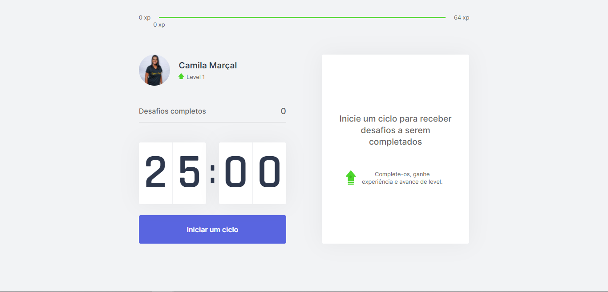

<p align="center">
  
</p>

<br>

<p align="center">
  
</p>

## :hammer_and_pick: Technologies

This project was developed using the following technologies:

- Next.js
- React
- TypeScript

## Preview
[](https://moveit-app-6br7hq4o4-camiladcm.vercel.app/)

## 🚀 Getting started

Clone the project and access the folder

```bash
$ git clone https://github.com/camiladcm/moveit-nlw04.git && cd moveit-nlw04
```

Follow the steps below
```bash
# Install the dependencies
$ yarn

# Start the project
$ yarn dev
```

## Project

This project was developed during the Next Level Week, presented by Rocketseat.  

## Information

This project was developed during the 1st Rocketseat Discover Marathon. 

## 📝 License

This project is licensed under the MIT License. See the [LICENSE](LICENSE.md) file for details.


---

Made by: Camila Marçal
